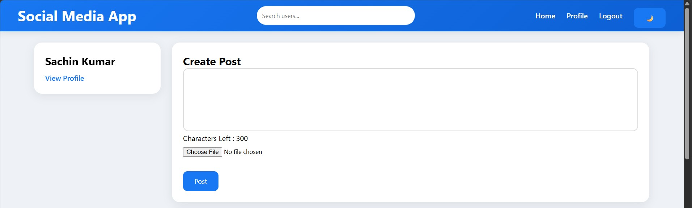

# 📱 Social Media Platform

A modern mini Social Media Platform built using Django, HTML, CSS, JavaScript, and SQLite.

---

## 🚀 Features

- User Registration & Login
- User Profiles
- Create Posts
- Upload Images
- Like & Comment System
- Follow / Unfollow Users
- Search Users
- Dark Mode
- Responsive UI

---

# 📸 Screenshots

---

---

## 👤 User Profile

---

## 🔍 User Search

---

## 🛠️ Technologies Used

### Frontend
- HTML5
- CSS3
- JavaScript

### Backend
- Django

### Database
- SQLite

---

## 🎯 Key Concepts Implemented

- Django Authentication
- CRUD Operations
- Django ORM
- Media Uploads
- Responsive Design
- User Relationships
- Social Media Features

---

## 👨‍💻 Author

**Sachin Kumar**

---
